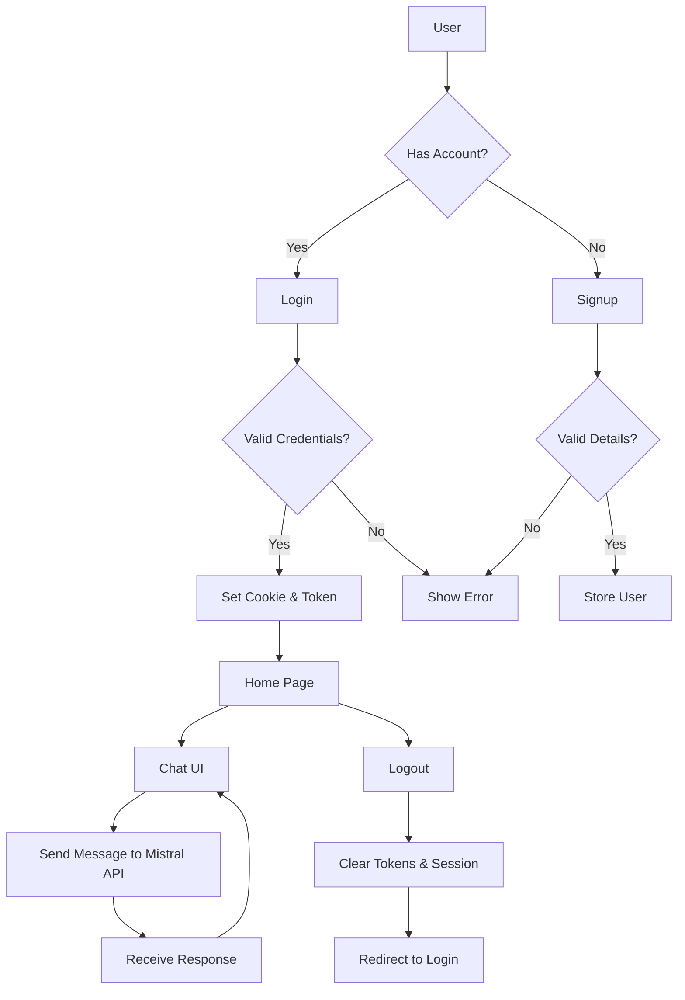

Phase 1 - Completed: Phase 1 focused on developing an MVP chat-bot, which leverages API calls to interact with users and provide basic functionality. This foundational phase enables further development and testing of the core features.

Upcoming Phases:

Phase 2: Integration of a RAG-based bot, such as a Quiz generator tailored to the LNMIIT curriculum.
